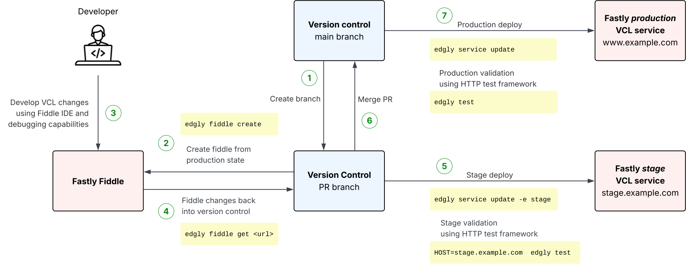

# @adobe/edgly

> Command line tool to boost Fastly VCL service development

[](https://www.npmjs.com/package/@adobe/edgly)
[](https://github.com/adobe/edgly/blob/main/LICENSE)
[](https://github.com/adobe/edgly/issues)
[](https://github.com/adobe/edgly/actions/workflows/main.yml)

---

`edgly` enables version control for [Fastly™ VCL services](https://www.fastly.com/documentation/guides/vcl/) with these features:

* Syncing between a local version controlled folder and a [Fastly VCL service](https://www.fastly.com/documentation/guides/vcl/)
* Staging environments for validating changes on real Fastly infrastructure before deploying to production
* Syncing with [Fiddles](https://fiddle.fastly.dev) to develop and test VCL snippets connected to version control
* Source [file structure](#files) for convenient editing, reading, diffing and reviewing of VCL code and service config
* Secret detection to prevent accidentally commiting credentials to version control
* Variable replacement for secrets and other dynamic configuration using `${{VAR}}`
* Automatic testing of services using HTTP test framework leveraging `*.http` files

Fastly is a service and trademark by [Fastly, Inc](https://www.fastly.com).

#### Table of Contents
<!-- @import "[TOC]" {cmd="toc" depthFrom=2 depthTo=2 orderedList=false } -->

<!-- code_chunk_output -->

- [Installation](#installation)
- [Usage](#usage)
- [Test Framework](#test-framework)
- [Files](#files)
- [Contributing](#contributing)
- [Licensing](#licensing)

<!-- /code_chunk_output -->


## Installation

```sh
npm install -g @adobe/edgly
```

## Usage

This diagram shows the development workflow supported using `edgly`:



### CLI usage
```
                             _       _       
                     ___  __| | __ _| |_   _ 
                    / _ \/ _` |/ _` | | | | |
                   |  __/ (_| | (_| | | |_| |
                    \___|\__,_|\__, |_|\__, |
                               |___/   |___/ 

                  https://github.com/adobe/edgly

USAGE
  edgly <command> [OPTS]

Boost Fastly™️ VCL service development

COMMANDS
  service             Fastly VCL service commands
  fiddle              Fastly VCL fiddle commands
  test                Run HTTP request tests
  version             Show version info
  shell-completion    Print completion script for .bashrc or .zshrc

GLOBAL OPTIONS
  -c, --config   Configuration file             [string] [default: "edgly.yaml"]
  -v, --verbose  Verbose output                                        [boolean]
  -h, --help     Show help                                             [boolean]

  Options can also be set as environment variables prefixed with EDGLY_.
  Example: --api-token becomes EDGLY_API_TOKEN.
```

### Get Fastly API Token

Interacting with the Fastly APIs (mostly `edgly service` commands) requires your personal Fastly API token.

1. [Retrieve your Fastly API token](https://docs.fastly.com/en/guides/using-api-tokens#creating-api-tokens)
2. Set it as `EDGLY_API_TOKEN` environment variable in your shell/terminal:
   ```
   export EDGLY_API_TOKEN=<token>
   ```

Alternatively you can also set it as argument on certain commands using `-t/--api-token <token>`.

### Initial setup

1. Create new service or use existing service from [Fastly](https://manage.fastly.com)
2. Get the service id from the Fastly UI
3. Open shell inside a git repo (one repo per Fastly service recommended)
4. [Set your Fastly API token](#get-fastly-api-token) inside the shell (if not yet)
5. Fetch the service configuration
   ```sh
   edgly service get --id <service-id>
   ```
   * Above will pull the `latest` version.
   * You can fetch the currently active version using
     ```sh
     edgly service get --id <service-id> -V active
     ```
   * You can fetch a specific version number using
     ```sh
     edgly service get --id <service-id> -V 42
     ```
6. Review for any secrets detected
7. Commit the newly added files

8. This will store the `<service-id>` in `edgly.yaml` and assume this to be the `production` environment.
9. Further updates (pulls) from the service can be done using just
   ```sh
   edgly service get
   ```

### Initial setup to create a stage environment

A stage environment allows to safely test changes in Fastly before deploying to the production service.

Please note this simply creates another VCL service in Fastly with separate domain names (that you have to define) to represent a stage environment. It does NOT currently use or support the [Fastly staging feature](https://docs.fastly.com/en/guides/working-with-staging) introduced in Spring 2025.

1. Add your choice of stage domains to [domains.yaml](#domainsyaml):
   ```yaml
   ...
   # environment 'stage'
   stage:
     - stage.example.com
     - stage2.example.com
   ```
2. [Set your Fastly API token](#get-fastly-api-token) inside the shell (if not yet)
3. Create stage service:
   ```sh
   edgly service create --env stage
   ```
4. By default this will name the stage service `<name> (stage)`. Use `--name <name>` to set a different name.
5. This will store the new stage service id in `edgly.yaml`. Commit this file and the updated `domains.yaml`.

### Develop changes using Fiddles

Developing with [Fastly Fiddles](https://fiddle.fastly.dev) is helpful as it allows to debug request handling in Fastly in depth. Note this will not work if the service uses entire VCL files, it only works with VCL snippets.

1. Create a new fiddle:
   ```sh
   edgly fiddle create
   ```
2. Click the printed link to open the Fiddle
3. Develop the VCL code in the Fiddle
4. To define separate snippets, use comment headers as described in [snippets format](#snippetsvcl)
5. Copy any tests needed for the work into the Fiddle
6. When done, pull the changes from the Fiddle:
   ```sh
   edgly fiddle get <fiddle-url>
   ```
6. Review the changes and commit

### Test changes in stage then deploy to production

1. [Set your Fastly API token](#get-fastly-api-token) inside the shell (if not yet)
2. Deploy to stage:
   ```sh
   edgly service update --env stage --activate
   ```
3. Wait for Fastly changes to rollout, usually less than 30 seconds
4. Run any tests against stage
   ```sh
   HOST=https://stage.example.com edgly test
   ```
5. If successful, deploy to production:
   ```sh
   edgly service update --activate
   ```
6. If something goes wrong, revert to old version using the Fastly UI

### Safely try out any changes in stage

Sometimes you might want to safely try out changes via the Fastly service UI without impacting production. This can be done on the stage service:

1. (Optional) Ensure stage is up to date with latest changes from version control:
   ```sh
   edgly service update -e stage
   ```
3. In the Fastly UI, make changes to your stage service (and activate)
4. Test changes
   1. manually test if that change works as expected
   2. run tests against stage
      ```sh
      HOST=<stage-host> edgly test
      ```
   3. ideally add new test case to `*.http` files
6. Iterate 2 and 3 until change is complete
7. Fetch changes from stage into version control:
   ```sh
   edgly service get -e stage
   ```
8. Commit
9. Deploy to production:
   ```sh
   edgly service update --activate
   ```

## Test Framework

The test framework supports running HTTP requests against your domain (Fastly service) and is compatible with Fastly Fiddle Tests. This allows sync and copy-and-paste between automated tests and Fastly Fiddles. It requires separate installation of the [tepi](https://tepi.deno.dev/) test tool, which is [Deno](https://deno.land/) based.

### Install tepi

Note that at least tepi version `1.1.4` is required (as of `edgly` version `1.3.4`).

Test execution requires installation of [tepi](https://tepi.deno.dev/):
1. Install [deno](https://deno.land/)
2. Install [tepi](https://tepi.deno.dev/)

   ```
   deno install --reload  --allow-read --allow-env --allow-net --allow-run -f -n tepi https://tepi.deno.dev/src/cli.ts
   ```

### Test case syntax

1. Tests are defined in `*.http` files in a `tests` folder (non configurable)
2. Each file can have multiple tests
3. Test format is the [tepi](https://tepi.deno.dev/) one, but supporting [Fastly Fiddle Tests](https://www.fastly.com/documentation/reference/tools/fiddle/testing/) in the response assertions
4. Supported Fiddle test assertions are documented in [TESTS.md](TESTS.md)
   - Note: Technically the Tepi assertions are also supported. However, it is recommended to stick to Fastly Fiddle Tests only.
5. Syntax
   ```
   ---
   <file metadata> (optional)
   ---

   ###
   ---
   <test metadata> (optional)
   ---
   POST /path
   <headers>  (optional)

   <body> (optional)

   <assertions>

   ###
   ```

#### Example test file

Example `*.http` file with two tests:

```
---
host: <%= Deno.env.get('HOST') || 'https://example.com' %>
---

###
GET /status=200

clientFetch.status is 200
clientFetch.bodyPreview is ""


###
---
id: example
---
POST /status=200
Header: value

{"request": "body"}

clientFetch.status is 200
```

### Run tests

Run tests against production:
```
edgly test
```

Custom host:
```
HOST=https://thumbnails.findmy.media  edgly test
```

Run specific test file:
```
edgly test tests/image.http
```

Run individual test:
```
# :5 = line number where test starts, the ### line
edgly test tests/image.http:5
```

### Visual Studio Code test support

The [tepi VS Code extension](https://marketplace.visualstudio.com/items?itemName=jupegarnica.tepi) can be supported, for syntax highlighting and test execution within the IDE.

#### VS Code setup

1. Add a file named `tepi` in the root of your VS Code workspace
   ```sh
   #!/bin/sh
   edgly test "$@"
   ```
2. Ensure the file is executable
   ```sh
   chmod u+x tepi
   ```
3. Add this to the VS Code workspace settings to prefer it to use this executable (come first on PATH):
   ```json
     "terminal.integrated.env.osx": {
       "PATH": ".:${env:PATH}"
     }
   ```
4. Reload window or restart VS Code to apply PATH change
5. Commit both `tepi` and `.vscode/settings.json` files to version control

#### VS Code test development flow

Inside VS Code you can now run tests individually:

1. Install [tepi extension for VS Code](https://marketplace.visualstudio.com/items?itemName=jupegarnica.tepi)
2. Open `tests/*.http` files in VS Code
3. Edit tests
4. Run test using the extension
   1. Run single test: click `run` above test case
   2. Run single test with full request/response output: click `run -d`
   3. Run all tests in file: click `run file`
   4. Run all tests: run `tepi` in terminal

## Files

| File | Purpose |
|------|---------|
| [edgly.yaml](#edglyyaml) | Meta-configuration for `edgly` itself |
| [service.json](#servicejson) | All Fastly service configuration that is not stored in any other files |
| [domains.yaml](#domainsyaml) | [Domains](https://docs.fastly.com/en/guides/working-with-domains) of the service (for all environments) |
| [snippets/*.vcl](#snippetsvcl) | [VCL snippets](https://docs.fastly.com/en/guides/using-regular-vcl-snippets) code |
| [vcl/*.vcl](#vclvcl) | [VCL files](https://docs.fastly.com/en/guides/uploading-custom-vcl) code. These are not supported in the [Fiddle feature](#develop-changes-using-fiddles)|
| [dictionaries/*.ini](#dictionariesini) | [Edge Dictionaries](https://docs.fastly.com/en/guides/about-dictionaries) for configuration |
| [dictionaries/private.*.ini](#dictionariesprivateini) | [Private dictionaries](https://docs.fastly.com/en/guides/working-with-dictionaries#private-dictionaries) for secrets |
| [acl.json](#acljson) | [IP access control lists](https://docs.fastly.com/en/guides/about-acls) |
| [tests/*.http](#test-framework) | Test files for the [HTTP Test framework](#test-framework) |
| `tests/fiddle.http` | Test file that will be synced to Fiddle test requests in `edgly fiddle create` and `edgly fiddle get`. To use a different file, set `--test-file <file>`. |

### Environment variable replacement

Most files below will support `${{VAR}}` environment variable replacement. This allows to inject dynamic values at runtime of `edgly` before updating the Fastly service, for example to keep secrets out of version control.

Format:

```
${{VAR}}
```

When running applicable comamnds such as`edgly service update` or `edgly service create`, the placeholder `${{VAR}}` will be replaced with the value of the environment variable `VAR`, which must be set in shell environment.

### edgly.yaml

`edgly` uses a `edgly.yaml` file in the current directory to store `edgly` specific configurations that are separate from the actual Fastly service definition. The file must also be version controlled and shared with the team. Most importantly, it tracks the service ids for the different environments.

Full configuration file example:

```yaml
# environment specific settings
# 'production' is the default and service.json is expected to be from production env
# other environment names can be custom and used with '-e <env>' on the cli
env:
  production:
    # fastly service id
    id: abcd1234
  stage:
    id: efgh5678
  dev:
    id: ijkl9012

# settings for fiddle sub commands
fiddle:
  # use different backends in fiddles
  backends:
    S3: "https://safe-s3.aws.com"

# settings for secret detection
secrets:
  # custom threshold for entropy to consider something a secret
  # default is 4.5 and should normally be not changed
  entropy_threshold: 3.8
  # list of dictionary keys to skip when detecting secrets
  # good to ignore false positives
  ignore_keys:
    - MY_KEY
    - S3_BUCKET
  # list of values to ignore when detecting secrets
  # good to ignore false positives
  ignore_values:
    - some-value-that-looks-like-a-secret
    - another-false-positive
```

### service.json

This file stores all service configuration that is not in any other files. This file format is basically an aggregation of the [Fastly service API](https://www.fastly.com/documentation/reference/api/services/) json responses.

Changing these settings is usually best done using the Fastly UI and then using `edgly service get -v <version>>` to fetch the updated values.

### domains.yaml

This file defines the [domains](https://docs.fastly.com/en/guides/working-with-domains) of the service for all environments (selected via `-e <env>` on the CLI).

```yaml
production:
  - name: example.com
    comment: Main site
  - name: example2.com
    comment: "Secondary site"
stage:
  # comments are optional, just a list of domains as strings is enough
  - stage.example.com
  - stage2.example.com
dev:
  - dev.example.com
  - dev2.example.com
```

#### History of domain configuration

Up until version `1.2.x`, domain configuration was stored in `edgly.yaml`. This was moved to the new `domains.yaml` file starting in version `1.3.0`.

`edgly service get` (when fetching from production) will automatically migrate the configuration to the new `domains.yaml` file:

```
> edgly service get
...
Found domains in edgly.yaml. Automatically migrating them to domains.yaml.
```

Other commands will provide a hint about the need to migrate:

```
> edgly service update
...
Found domains in edgly.yaml. 'edgly service get' (production) will migrate them to domains.yaml.
```

The old configuration in `edgly.yaml` required to provide a map of the production domains to the domains for other environments:

```yaml
env:
  production:
    id: 12345
  stage:
    id: 67890
    domains:
      example.com: "stage.example.com"
      example2.com: "stage2.example.com"
```

The production domains were stored in the `service.json` file, which was confusing. More importantly, this design created [issue #25](https://github.com/adobe/edgly/issues/25) and thus starting with `1.3.0` domains are configured as first-class citizens in `domains.yaml` and are listed there for all environments including production.


### snippets/*.vcl

This contains the code for any [VCL snippets](https://docs.fastly.com/en/guides/using-regular-vcl-snippets). There will be one file for each VCL phase, containing all the snippets for that phase. Snippets are generally recommended since they work with Fiddles with `edgly`, unlike VCL files.

Folder structure example:
```
snippets/
  init.vcl
  recv.vcl
  fetch.vcl
```

Each file will contain surrounding VCL boilerplate to make syntax highlighting and IDE extensions such as [Fastly VCL for VS Code](https://marketplace.visualstudio.com/items?itemName=fastly.vscode-fastly-vcl) work.

Example `snippets/deliver.vcl`:

```vcl
include "init.vcl";

sub vcl_deliver {
  #FASTLY deliver

  # ===================================================================
  # name: deliver 100 - unset undesired headers
  # prio: 100
  # ===================================================================

  unset resp.http.server;
  unset resp.http.via;

  # ===================================================================
  # name: deliver 200 - set x-custom-header
  # prio: 200
  # ===================================================================

  set resp.http.x-custom-header = "custom value";

  # ===================================================================
}
```

The actual snippets are defined using **structured comment headers**. These set the name and priority, and are ordered by priority number:

```vcl
  # ===================================================================
  # name: <snippet-name>
  # prio: <priority>
  # ===================================================================

  <VCL code>

  # ===================================================================
```

When creating new snippets this format has to be strictly followed. You will also see this format in the Fiddles created by `edgly fiddle create` when [developing changes using Fiddles](#develop-changes-using-fiddles). To "create" new snippets while coding in Fiddles, the above format has to be followed exactly. The granularity of snippets is the choice of the developer.

### vcl/*.vcl

This stores any [VCL files](https://docs.fastly.com/en/guides/uploading-custom-vcl) of the service.

Each custom VCL file will be stored by it's name in the `vcl` folder:
```
vcl/
  custom.vcl
  another.vcl
```

Generally one should avoid mixing VCL snippets and VCL files in the same service/project. VCL files are not supported in Fiddles with `edgly fiddle *`.

### dictionaries/*.ini

This defines the [Edge Dictionaries](https://docs.fastly.com/en/guides/about-dictionaries) allowing configuration that can also be changed in Fastly without a service redeployment.

These are stored in a simple variant of the [INI file format](https://en.wikipedia.org/wiki/INI_file).

Example `dictionaries/config.ini`:

```ini
S3_BUCKET="my-bucket"
S3_REGION="us-east-1"
```

Each key-value pair corresponds to a dictionary item.

Note that double-quoting values is highly recommended (and `edgly service get` will automatically quote values when writing to disk).

This does not support or use INI sections. Comments can be lost on round-tripping through `edgly service update` and `edgly service get`.

### dictionaries/private.*.ini

[Private dictionaries](https://docs.fastly.com/en/guides/working-with-dictionaries#private-dictionaries) are stored like [regular dictionaries](#dictionariesini) but using the filename pattern `private.*.ini`.

As these usually contain secrets, one can use the [environment variable replacement](#environment-variable-replacement) feature of `edgly`.

Example `private.secrets.ini`:
```ini
# Private (write-only) dictionary 'secrets'
# last_updated: 2024-05-20 22:02:28
# item_count: 6
# digest: 123456789abcdef
S3_ACCESS_KEY="${{S3_ACCESS_KEY}}"
S3_SECRET_KEY="${{S3_SECRET_KEY}}"
```


### acl.json

Stores any [IP access control lists](https://docs.fastly.com/en/guides/about-acls) in the JSON format of the [Fastly ACL API](https://www.fastly.com/documentation/reference/api/acls/).

`acl.json` example:
```json
[
  {
    "id": "abcdef123456789",
    "name": "my_ips",
    "entries": [
      {
        "comment": "Local 1",
        "id": "abcdef1111111",
        "ip": "127.0.0.1",
        "negated": "0",
        "subnet": 32
      },
      {
        "comment": "Local 2",
        "id": "abcdef999999",
        "ip": "127.0.0.2",
        "negated": "0",
        "subnet": 32
      }
    ]
  }
]
```


## Contributing
Contributions are welcome! Read the [Contributing Guide](./.github/CONTRIBUTING.md) for more information.

## Licensing
This project is licensed under the Apache V2 License. See [LICENSE](LICENSE) for more information.
